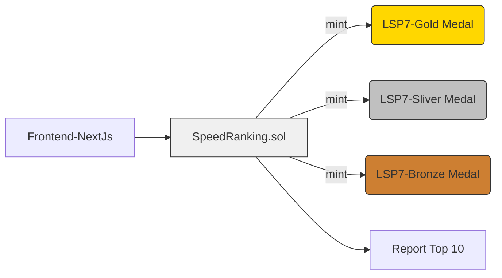

# 🏁 Reaction Time Game – LUKSO Mini dApp

A fun, fast-paced reaction-time game built on LUKSO. Test your reflexes, earn your spot on the leaderboard, and claim **LSP7 Medal Tokens** as proof of your performance—all integrated with **Universal Profiles**.

---

## 🚀 Overview

This mini dApp challenges users to click the screen as quickly as possible when it changes color. Based on their reaction speed, users can:

* Mint a **medal NFT** as a reward (Gold, Silver, or Bronze — LSP7 standard).
* Be featured on the **leaderboard** with their Universal Profile name and reaction time.
* Own a unique moment of performance on-chain via lightweight interaction (just `0.01 LYX`).

---

## ⚙️ Smart Contract: [`RankingList.sol`](./smartcontract/contracts/RankingList.sol)

This contract handles:

* Collecting fees for participation
* Logging and ranking user reaction times
* Minting LSP7 token-based NFTs as rewards
* Managing leaderboard data
* Transferring or updating NFT contracts

---

## 🧱 Architecture



---

## 🛠️ Features

* 🧠 **Universal Profile-Ready:** Uses UP for identity and token ownership
* 🏅 **LSP7 Medal NFTs:** Minted on performance (Gold/Silver/Bronze)
* 💸 **Micro Transaction:** Only `0.01 LYX` to enter
* 📊 **Leaderboard System:** Top 10 fastest players tracked on-chain
* 🔐 **Ownership Control:** Contract owner can update medal NFTs and fees

---

## 🧹 Contracts

| Contract           | Description                                                                        |
| ------------------ | ---------------------------------------------------------------------------------- |
| `RankingList`      | Main contract with logic for speed logging, ranking, NFT minting, and fee handling |
| `INFT`             | Interface for interacting with LSP7-compatible NFTs (Medals)                       |
| `SpeedRankingCore` | Core logic for storing and comparing reaction times (inherited)                    |

---

## 💡 How It Works

1. User plays the game and sees their reaction time.
2. If they want a medal, they call `mintWithSpeed(speed)` with a `0.01 LYX` fee.
3. The contract logs their time, checks their rank, and:

   * Mints a **Gold** medal for 1st place
   * Mints a **Silver** medal for 2nd place
   * Mints a **Bronze** medal for all other entries
4. Their score is added to the **top 10 leaderboard**.
5. The fee is forwarded to the contract owner.

---

## 🧪 Usage (Sample Call)

```solidity
rankingList.mintWithSpeed{value: 0.01 ether}(reactionTime);
```

* `reactionTime` is an integer representing milliseconds (e.g., `123` for 123ms).

---

## 🔐 Admin Functions

| Function                                     | Description                                       |
| -------------------------------------------- | ------------------------------------------------- |
| `setFee(uint256)`                            | Set new fee to play                               |
| `setMedalAddress(address, address, address)` | Update NFT medal contracts                        |
| `transferOwnershipOfNFT(...)`                | Transfer NFT ownership                            |
| `isNFTOwnedByContract()`                     | Check if medals are under this contract's control |
| `setNFTData(...)`                            | Update metadata for an NFT                        |

---

## 🛆 Tech Stack

* **Solidity** `^0.8.12`
* **LUKSO**: Universal Profiles, LSP7 Token Standard
* **Hardhat** for testing & deployment
* **Frontend**: Inherited and extended from [LUKSO Miniapp Next.js Template](https://github.com/lukso-network/miniapp-nextjs-template)

---

## 🌐 Access

* **Testnet:** [universaleverything.io – Testnet View](https://universaleverything.io/0xF062D792ad6B55679F0662bcFEd230AAf9Bf3644?network=testnet&assetGroup=grid)
---

## 📃 License

Licensed under **Apache-2.0**.

---

## 🙌 Credits

Built with ❤️ on LUKSO
Inspired by games that blend **fun** with **functional on-chain identity**.
